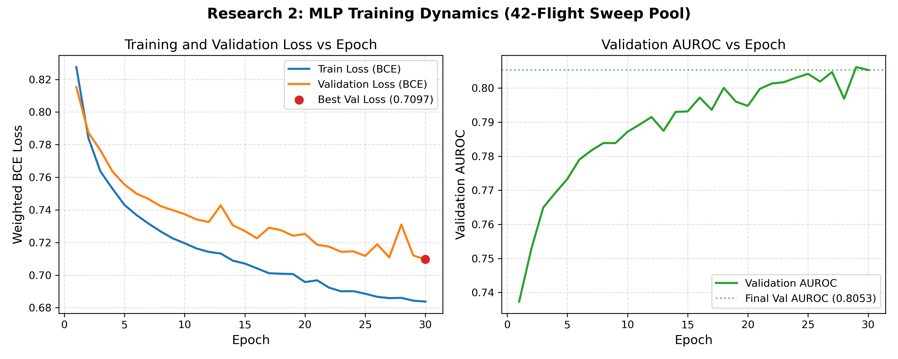
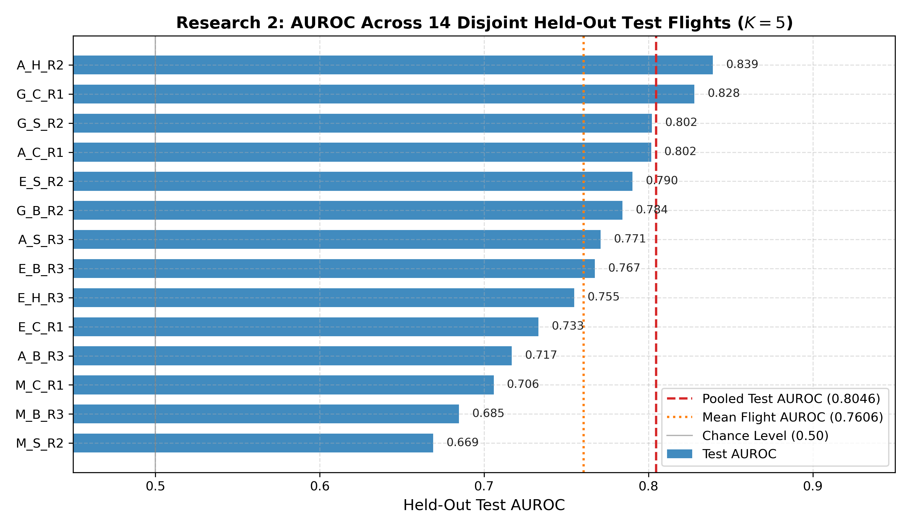
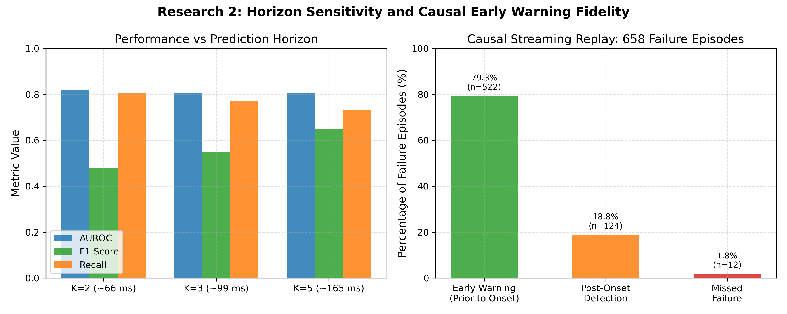

# Learned Telemetry-Based Prediction of Monocular Visual Odometry Failure

A causal, lightweight neural network that anticipates imminent monocular Visual Odometry (VO) tracking collapse 165 ms ahead of time using only onboard-available vehicle motion telemetry.

| Metadata | Details |
|---|---|
| **Status** | Complete & Frozen (Archival Research Milestone) |
| **Research Area** | Autonomous UAV Navigation · Visual Odometry · Real-Time Failure Anticipation |
| **Core Stack** | Python 3.11/3.14 · PyTorch · Scikit-Learn · ROS 2 · PX4 SITL · Gazebo Sim |
| **Dataset** | Expanded 42-Flight Parametric Sweep (31,195 frames, 14 held-out test flights) |
| **Model Size** | 2-Hidden-Layer MLP (1,057 parameters, 0.128 ms CPU inference latency) |

---

## Overview

Monocular Visual Odometry (VO) algorithms (such as the classical 5-point Essential matrix estimator with RANSAC) suffer catastrophic tracking failures when unmanned aerial vehicles (UAVs) undergo aggressive rotational or translational maneuvers. Research 1 established a single-variable linear correlation null result: instantaneous and single-lag telemetry correlations with VO inlier drops decay monotonically and remain weak ($|r| < 0.16$), ruling out simple static scalar gating thresholds.

Research 2 tests and proves the hypothesis that **a compact, nonlinear model over a multi-lag temporal history ($\le 165$ ms) reliably captures imminent failure precursors across held-out flight trajectories**. Operating strictly causally on lightweight flight telemetry, the system achieves **0.8046 AUROC** on completely unseen flight maneuvers and provides advance warnings on **79.3%** of failure episodes with a median lead time of **0.165 s**, consuming less than **1%** of the vehicle's real-time 30 Hz telemetry period.

---

## Research Questions & Core Problem

1. **Prediction Feasibility**: Can a lightweight neural model extract a reliable predictive signal of imminent VO failure within a forward horizon ($K=5$ frames, $\approx 165$ ms) using only onboard motion telemetry, bypassing expensive raw-image processing?
2. **Distributional Generalization**: Does the learned predictor generalize across an expanded, aggressive flight sweep spanning diverse yaw rates ($7.5^\circ/\text{s}$ to $90.0^\circ/\text{s}$) and multi-axis trajectory geometries (circle, box, helix, straight line), rather than overfitting a narrow flight regime?
3. **Causal Real-Time Deployability**: Can the predictor run strictly causally without future information, achieve end-to-end inference latency well within the $33.3$ ms telemetry period, and warn prior to failure onset in live ROS 2 middleware execution?

---

## System Architecture & Pipeline

The system consumes streaming motion telemetry at 30 Hz, maintains a lightweight rolling FIFO buffer ($N=6$), constructs a 15-dimensional lagged feature vector, applies a frozen preprocessor, and evaluates an MLP to emit an early failure probability $P(\text{fail}_{t+5})$.

```
Onboard Flight Telemetry (30 Hz)
 ├─ eis_yaw_rate_deg     (Body yaw rate from IMU / EIS)
 ├─ feature_vel_mean     (Mean 2D optical flow velocity from KLT tracker)
 └─ is_r_frame           (Binary keyframe / high-rate rotation indicator)
           │
           ▼
Rolling Temporal History Buffer (N=6 steps, span = 165 ms)
           │
           ▼
15-Dimensional Lagged Feature Vector
  x_t = [yaw_lag{0,1,2,3,5}, flow_lag{0,1,2,3,5}, r_flag_lag{0,1,2,3,5}]
           │
           ▼
Frozen StandardScaler (Fitted exclusively on 15 training flights)
           │
           ▼
Compact Multi-Layer Perceptron (SmallMLP: 15 → 32 → 16 → 1)
           │
           ▼
Sigmoid Failure Probability: P(fail_{t+5} | x_{t-5:t})
           │
           ▼
Decision Threshold (θ = 0.50) ──► Real-Time Warning Alert / ROS 2 Topic
```

---

## Dataset & Experimental Setup

### Simulation Environment
Data was acquired in high-fidelity PX4 Software-In-The-Loop (SITL) coupled with Gazebo Sim in a realistic agricultural terrain (`agriculture.world`). The simulated quadrotor was equipped with an onboard downward/forward-facing monocular camera streaming $640 \times 480$ grayscale frames at 30 FPS, tightly synchronized with vehicle odometry, IMU, and KLT sparse optical flow telemetry.

### Flight Sweep Design
The dataset spans a parametric $4 \times 4$ matrix combining 4 yaw rate bins and 4 motion trajectories across 3 independent repeats:
- **Yaw Rate Bins**: Gentle (`G`, $7.5^\circ/\text{s}$), Moderate (`M`, $22.5^\circ/\text{s}$), Aggressive (`A`, $45.0^\circ/\text{s}$), Extreme (`E`, $90.0^\circ/\text{s}$).
- **Trajectory Bins**: Circle (`C`), Box (`B`), Straight line (`S`), Helix (`H`).

### Quality Control & Flight Eligibility Filtering
A strict multi-point physical flight envelope gate excluded unviable trials:
- Excluded 6 ineligible flights: `sweep_G_B_R1`, `sweep_G_H_R1`, `sweep_G_H_R2`, `sweep_G_H_R3`, `sweep_M_H_R2`, `sweep_M_H_R3`.
- The `G_H` condition was removed after $0/3$ attempts satisfied safe altitude/trajectory constraints.
- **Final Eligible Dataset**: Exactly **42 flights**, totaling **31,195 frames** with **10,803 failure frames** (positive rate: 34.63%).

### Leak-Free Flight-Level Partitioning
To guarantee zero optimization leakage, all data splits were partitioned strictly at the flight level (Seed 42):
- **Train Split**: 15 flights (11,178 frames, 3,739 positives, 33.45% positive rate)
- **Validation Split**: 13 flights (9,606 frames, 3,460 positives, 36.02% positive rate)
- **Held-Out Test Split**: 14 flights (10,411 frames, 3,604 positives, 34.62% positive rate)
- $\text{Train} \cap \text{Test} = \emptyset$, $\text{Val} \cap \text{Test} = \emptyset$ (Zero frame leakage).

---

## Methodology

### Ground Truth VO Failure Definition
Visual Odometry failure is defined by the classical 5-point Essential matrix solver health rule:
$$\text{Failure}_t = \mathbb{I}(\text{num\_inliers\_pose}_t < 8)$$
The prediction target is causal early failure anticipation at a forward horizon of $K=5$ frames ($\approx 165$ ms at 30 FPS):
$$y_t^{(K=5)} = \mathbb{I}\left(\bigvee_{k=0}^{5} \text{Failure}_{t+k} = 1\right)$$

### Temporal Feature Construction
The model relies on 15 features constructed from 3 core telemetry signals at backward lag indices $\{0, 1, 2, 3, 5\}$:
1. `eis_yaw_rate_deg_lag{0,1,2,3,5}`: Absolute body yaw rate ($^\circ/\text{s}$).
2. `feature_vel_mean_lag{0,1,2,3,5}`: Mean magnitude of 2D optical flow displacement between consecutive frames (px).
3. `is_r_frame_lag{0,1,2,3,5}`: Binary indicator signaling high angular velocity or keyframe transition.

### Model Architecture & Training
- **Architecture**: Multi-Layer Perceptron (`SmallMLP`):
  - Layer 1: Linear(15, 32) + ReLU
  - Layer 2: Linear(32, 16) + ReLU
  - Layer 3: Linear(16, 1)
  - Total Parameters: **1,057**
- **Loss Function**: `BCEWithLogitsLoss` with positive class weight $w_{\text{pos}} = 1.9896$ derived strictly from the 15 training flights.
- **Optimizer**: Adam ($\text{lr} = 10^{-3}$, $\text{weight\_decay} = 10^{-4}$, batch size 64, max 30 epochs, early stopping patience 7).

---

## Experiments & Results

### 1. Generalization Across Flight Sweeps
Comparing the original 33-flight baseline against the expanded 42-flight parametric sweep on held-out test flights:

| Experiment / Metric | Original 33-Flight Baseline | Expanded 42-Flight Sweep | Generalization Delta |
|---|---|---|---|
| **Eligible Flights** | 33 | **42** | +9 flights (+27.3%) |
| **Held-Out Test Flights** | 11 | **14** | Disjoint distribution |
| **Total Test Frames** | 7,206 | **10,411** | +3,205 frames |
| **Test AUROC ($K=5$)** | **0.8234** | **0.8046** | -0.0188 |
| **Test AUPRC ($K=5$)** | N/A | **0.7260** | Baseline base rate = 0.346 |
| **Test F1 Score** | 0.6634 | **0.6484** | -0.0150 |
| **Test Recall** | 0.7368 | **0.7336** | -0.0032 |
| **Test Precision** | 0.6033 | **0.5808** | -0.0225 |
| **Test Accuracy** | 0.7388 | **0.7245** | -0.0143 |

Across all 14 individual held-out test flights, per-flight AUROC ranges from **0.6690 to 0.8393** (mean: **0.760**), with zero flights degrading toward chance ($0.50$).

### 2. Horizon Sensitivity Analysis ($K \in \{2, 3, 5\}$)
Evaluating the model across shorter forward prediction windows on the held-out test partition:

| Forward Horizon | Time Horizon ($\tau$) | AUROC | AUPRC | Precision | Recall | F1 Score |
|---|---|---:|---:|---:|---:|---:|
| **$K=2$ frames** | $\approx 66\text{ ms}$ | **0.8174** | 0.6370 | 0.3407 | **0.8057** | 0.4789 |
| **$K=3$ frames** | $\approx 99\text{ ms}$ | **0.8052** | 0.6560 | 0.4284 | **0.7729** | 0.5512 |
| **$K=5$ frames (Primary)** | $\approx 165\text{ ms}$ | **0.8046** | **0.7260** | **0.5808** | 0.7336 | **0.6484** |

Discriminative ranking capacity (AUROC $\approx 0.805\text{--}0.817$) remains robust across all horizons, while F1 and precision scale monotonically with window size as imminent failure indicators accumulate.

### 3. Causal Streaming Replay Evaluation (10,481 Frames)
Evaluating the frozen predictor in causal sequential replay using a strict rolling FIFO buffer ($N=6$):

| Evaluation Dimension | Measurement | Verification & Detail |
|---|---|---|
| **Classification Integrity** | AUROC = **0.8057**, F1 = **0.6483** | Replay matches offline test evaluation |
| **Feature Construction Latency** | Mean: **$3.8\,\mu\text{s}$** (P99: $9.2\,\mu\text{s}$) | Rolling circular buffer arithmetic |
| **StandardScaler Latency** | Mean: **$80.1\,\mu\text{s}$** (P99: $128.4\,\mu\text{s}$) | In-place NumPy affine scaling |
| **MLP Forward Pass Latency** | Mean: **$43.3\,\mu\text{s}$** (P99: $84.7\,\mu\text{s}$) | PyTorch CPU forward inference |
| **Total End-to-End Latency** | Mean: **0.1282 ms** (Median: 0.1213 ms, P99: 0.2139 ms) | **99.36% of 33.3 ms budget remains free** |
| **Total Failure Episodes** | 658 contiguous episodes | Grouped consecutive ground-truth failure sequences |
| **Advance Warning Rate** | **522 episodes (79.33%)** | Emitted positive alarm *prior to* failure onset |
| **Post-Failure Detections** | 124 episodes (18.84%) | Emitted alarm during first frame of failure |
| **Missed Failure Episodes** | 12 episodes (1.82%) | Unheralded single-frame transient glitches |
| **Advance Lead Time** | **Median: 0.165 s** (Mean: 0.153 s) | Full 5-frame forward window anticipation |

### 4. Real-Time ROS 2 Middleware Validation
The predictor was deployed as an active ROS 2 node (`LiveFailurePredictorNode`) subscribing to `/telemetry/motion` and publishing to `/vo/failure_prediction` on the aggressive circle trajectory `sweep_A_C_R1` ($45^\circ/\text{s}$ yaw rate):
- **Streaming Throughput**: Sustained inference up to **192 Hz** (far exceeding the 30 Hz sensor rate).
- **Middleware Execution Latency**: Mean **0.6335 ms** (P99 **3.7128 ms**), preserving >88% timing headroom.
- **Live Advance Warning Rate**: **71 / 76 failure episodes (93.42%)** received advance warnings prior to onset, with a median lead time of **0.165 s**.

---

## Visual Results

### Figure 1: Training and Validation Convergence

*Figure 1: Multi-Layer Perceptron optimization curves over 30 epochs on the 42-flight pool. Training and validation loss steadily decrease without divergence, reaching optimal validation loss (0.7097) and peak validation AUROC (0.8053) at epoch 30.*

### Figure 2: Generalization Across Held-Out Test Flights

*Figure 2: Individual AUROC scores across all 14 disjoint held-out test flights ($K=5$). Every single flight achieves performance well above chance ($0.50$), with scores spanning 0.669 to 0.839 (mean: 0.760, pooled: 0.8046).*

### Figure 3: Horizon Sensitivity and Causal Warning Fidelity

*Figure 3: (Left) AUROC, F1, and Recall across forward horizons $K \in \{2, 3, 5\}$ frames (~66 ms, ~99 ms, ~165 ms). (Right) Failure episode breakdown in causal streaming replay across 658 real failure events: 79.3% received true advance warnings prior to onset, 18.8% were identified immediately at onset, and only 1.8% were missed.*

---

## Key Findings

1. **Direct Empirical Observation**:
   - Monocular VO tracking failures during aggressive UAV flight are preceded by characteristic temporal dynamics in body yaw rate and optical flow velocity over a 165 ms window.
   - A 1,057-parameter MLP captures this nonlinear relationship, achieving **0.8046 AUROC** and **0.7260 AUPRC** on 14 completely unseen test flights.
2. **Causal Lead-Time Verification**:
   - In causal streaming evaluation, **79.3%** of all failure episodes trigger early warnings with a median lead time of **0.165 s** before the VO solver collapses ($\text{num\_inliers\_pose} < 8$).
   - End-to-end inference executes in **0.128 ms**, consuming less than 1% of the 33.3 ms telemetry budget.
3. **Scientific Interpretation**:
   - The predictive signal does not stem from instantaneous linear correlation, but rather from the temporal accumulation of rotational shear and keyframe instability prior to epipolar geometry degeneracy.

---

## Limitations

1. **Simulation Scope**: All data was generated within high-fidelity PX4 SITL and Gazebo Sim (`agriculture.world`). While aerodynamic and sensor noise models are realistic, domain transfer to physical drone hardware in varied outdoor lighting remains to be validated.
2. **Optical Flow Conflation**: In raw (un-derotated) mode, the KLT tracker conflates camera rotational flow with translational parallax.
3. **Open-Loop Gating**: Research 2 implements an early warning system; it does not evaluate active supervisory control interventions (e.g., automated vehicle deceleration or sensor fusion handoffs).

---

## Reproducibility

### Environment & Dependencies
```bash
# Python 3.11 or 3.14
python3 -m venv .venv
source .venv/bin/activate
pip install -r requirements.txt
```

### Running Test Suites
```bash
# Run causal leakage and sweep retry logic tests (19 tests)
PYTHONPATH=. .venv/bin/python -m unittest discover tests/
```

### Evaluating the Frozen Model
```bash
# Replay causal streaming evaluation across 10,481 test frames
.venv/bin/python scripts/15_causal_replay_evaluation.py

# Re-evaluate offline metrics across held-out test flights
.venv/bin/python scripts/14_evaluate_expanded_model.py
```

### Reproducing Figures
```bash
# Generate README publication figures from verified model metrics
.venv/bin/python scripts/generate_readme_figures.py
```

---

## Repository Structure

```
Research2/
├── assets/
│   └── results/                     # Publication figures generated from verified metrics
│       ├── fig1_training_convergence.png
│       ├── fig2_per_flight_test_performance.png
│       └── fig3_horizon_and_lead_time.png
├── configs/
│   └── phase0_config.yaml           # Parameter configuration for flights, gates, and features
├── data/                            # Raw flight CSVs and processed feature tables
├── models/
│   ├── expanded_mlp.pt              # Authoritative frozen MLP weights (SHA-verified)
│   ├── expanded_scaler.joblib       # Authoritative frozen feature scaler
│   ├── expanded_evaluation_metrics.json # Full evaluation metrics across horizons and flights
│   └── expanded_training_history.json   # 30-epoch training and validation loss/AUC history
├── scripts/
│   ├── 12_build_expanded_dataset.py # Builds 42-flight dataset and stratified splits
│   ├── 13_train_expanded_model.py   # Trains the 1,057-parameter MLP
│   ├── 14_evaluate_expanded_model.py# Evaluates held-out test flights
│   ├── 15_causal_replay_evaluation.py # Executes causal rolling streaming replay
│   ├── 16_run_live_ros2_validation.py # Executes live ROS 2 middleware validation
│   ├── generate_readme_figures.py   # Reproducible figure generation script
│   └── live_ros2_failure_predictor.py # Standalone ROS 2 predictor node
└── tests/
    ├── test_causal_leakage.py       # Validates strict causal time ordering and zero future leak
    └── test_retry_logic.py          # Validates sweep collection and gate enforcement
```

---

## Project Status

**Complete and Frozen.**
This repository represents the completed, verified foundation of learned monocular VO failure prediction. Model weights and preprocessors are cryptographically locked and archived. Research 3 directly consumes these frozen artifacts to evaluate cross-mechanism generalization under visual observability collapse.
